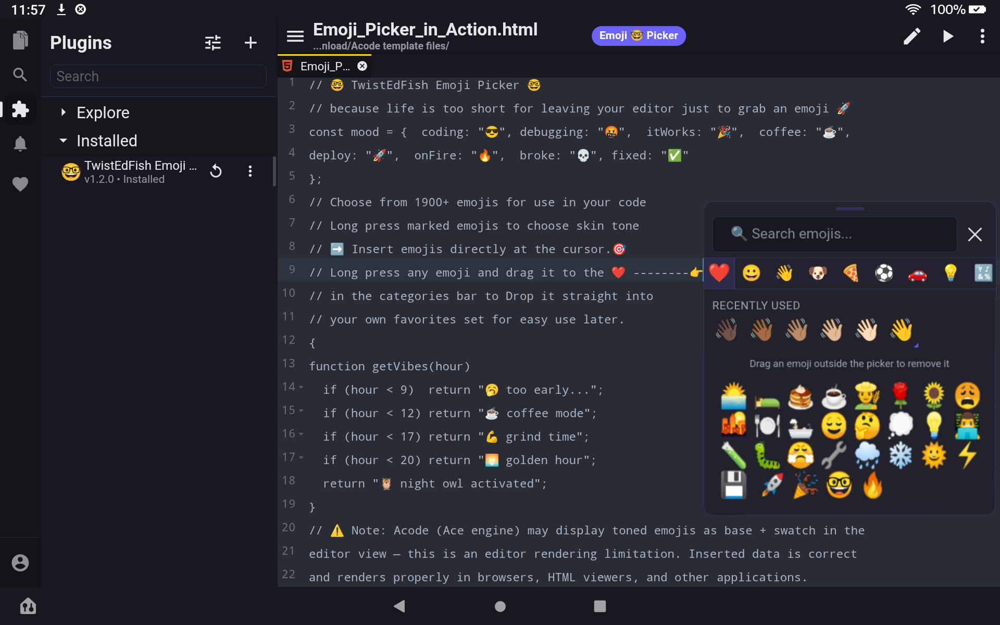

# TwistEdFish Emoji Picker

A fast, categorized emoji picker for the Acode editor. Tap the **Emoji 🤓 Picker** button in the top bar to open the panel and tap any emoji to insert it at your cursor position.

---

---

## Features

- **1,906 emojis** across 9 categories — Smileys, People, Animals, Nature, Food, Activities, Travel, Objects, Symbols, and Flags
- **Favorites** — drag any emoji onto the ❤️ tab to save it. Drag a favorite outside the picker panel to remove it. Favorites persist across sessions.
- **Search** — find emojis by keyword across all categories
- **Recently Used** — quick-access strip of your last 20 inserted emojis (session only)
- **Draggable panel** — drag the handle at the top to reposition the picker anywhere on screen
- **Keyboard shortcut** — Ctrl+Alt+E to open/close
- **Theme-aware** — uses Acode CSS variables for seamless dark and light theme compatibility
- **Dual editor support** — works with both Ace and CodeMirror 6 editors

---

## Usage

### Opening the picker
Tap the **Emoji 🤓 Picker** button in the Acode top bar, or press **Ctrl+Alt+E**.

### Inserting an emoji
Tap any emoji to insert it at your cursor position. The panel closes automatically.

### Favorites
Drag any emoji and drop it onto the ❤️ tab at the left of the category bar — the tab glows when ready to receive a drop. To remove a favorite, switch to the ❤️ tab, then drag the emoji outside the picker panel and release.

### Search
Type in the search bar to find emojis by keyword. Results update as you type.

### Recently Used
The top of each category view shows your last 20 inserted emojis for quick repeat access.

---

## Changelog

See [changelogs.md](changelogs.md) for full version history.

---

## License

MIT — made with care by TwistEdFish
